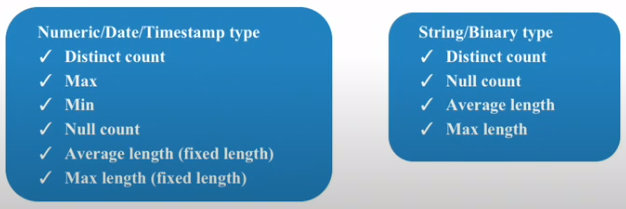
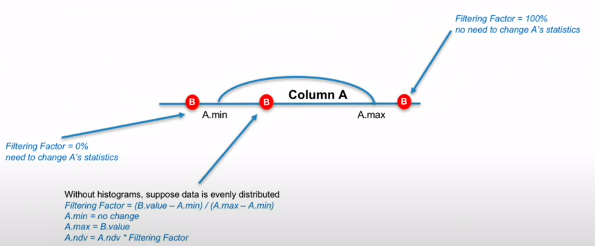

**1. Collect, infer and propagate table and column statistics on source and intermediate data**

```hql
ANALYZE TABLE table_name COMPUTE STATISTICS

ANALYZE TABLE table_name COMPUTE STATISTICS FOR COLUMNS col_name1, col_name2 ...
```



====================================

**2. Filter cardinality estimation**

```
// <, <=, >, >=, <=> : use for Integers, Double, Date, Timestamp
// =, <=> : use for String, Integers, Double, Date, Timestamp
```



====================================

**3. **
