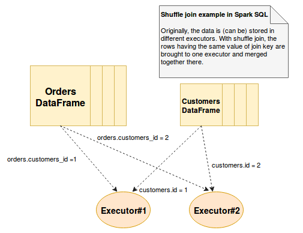
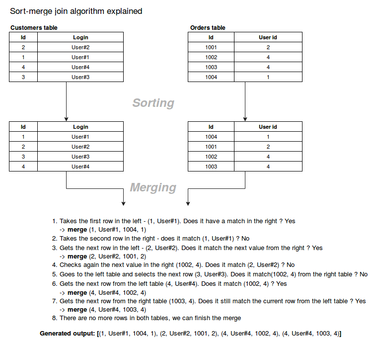

The rules are based on [`Ted Malaska`](https://github.com/TedBear42) speach from SparkSummit (_Tricks of the Trade to be an Apache Spark Rock Star_) which really help me and they work 

1. Use local demo and debugging (IDE could help you)

2. Use unit tests (also you must create an covering document with inputs and outputs requirements)

3. Don't put all eggs in a basket => Create each stage is isolated

4. Use nested types and DataFrames


5. Use SQL politicly (note: SQL is fater then hand written code)

```
-- set data types explicitly
MAX(AMOUNT) -> MAX(cast(AMOUNT as DOUBLE))
```

SQL best optimization:

- Explan: => EXPLAIN EXTENDED

- Set up SQL config:

```
-- set partitions
spark.sql.files.maxPartitionBytes
spark.sql.shuffle.partitions

--set broadcast thresholds
spark.sql.broadcastTimeout
spark.sql.autoBroadcastJoinThreashold
```

- Joins for:

| Join Type        | What For     |
| :-------------: |:-------------:| 
| Shuffle join      | Shuffle join, as every shuffle operation, consists on moving data between executors (use if BroadCast join couldn't works as default) | 
| BroadCast Join     | BroadCast join is an optimized hash join (can be very efficient for joins between a large table (fact) with relatively small tables)|
| Bucketed Sorted Merge Join     | The name of this method tells its own tale- there are 2 main steps: sort, merg (use if you join huge data sets)| 

**Shuffle join** looks like:




**Sorted Merge Join** looks like:



6. Add more keys to joins 

