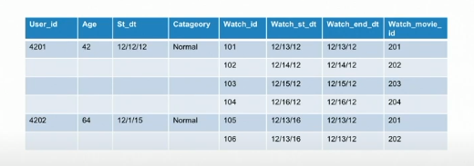

The rules are based on [`Ted Malaska`](https://github.com/TedBear42) speach from SparkSummit - Tricks of the Trade to be an Apache Spark Rock Star

1. Use local demo and debugging (IDE could help you)

2. Use unit tests (also you must create an covering document with inputs and outputs requirements)

3. Don't put all eggs in a basket => Create each stage is isolated

4. Use nested types and DataFrames



5. Use SQL politicly 

hql```
MAX(AMOUNT) -> MAX(cast(AMOUNT as DOUBLE))
```

6. Add more keys to joins 
